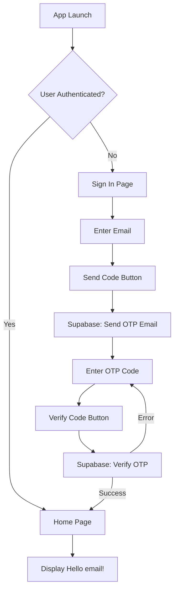

# OTP Authentication Implementation Plan

## Overview

Implement email OTP (one-time password) authentication using Supabase Auth. Users will enter their email, receive a 6-digit code, verify it, and then access the home screen showing their email.

## Architecture Flow

## Implementation Steps

### 1. Verify Supabase Configuration

- Verify email signup remains disabled in [`supabase/config.toml`](supabase/config.toml) (app is invite-only):
  - `enable_signup = false` in `[auth]` section (already set)
  - `enable_signup = false` in `[auth.email]` section (already set)
- OTP is already configured (6 characters, 3600s expiry)
- Note: `signInWithOtp()` will only work for users who already exist in the system (invited users)

### 2. Add Flutter Dependencies

- Add `supabase_flutter` package to [`client-flutter/pubspec.yaml`](client-flutter/pubspec.yaml)
- Add `flutter_dotenv` for environment variable management (to store Supabase URL and publishable key)

### 3. Create Supabase Client Service

- Create [`client-flutter/lib/services/supabase_service.dart`](client-flutter/lib/services/supabase_service.dart):
  - Initialize Supabase client with URL and publishable key
  - Provide singleton access to Supabase client
  - Handle auth state changes

### 4. Create Authentication State Management

- Create [`client-flutter/lib/providers/auth_provider.dart`](client-flutter/lib/providers/auth_provider.dart):
  - Use `ChangeNotifier` or similar for state management
  - Track authentication state (signed in/out)
  - Provide methods: `sendOTP(email)`, `verifyOTP(email, token)`, `signOut()`
  - Listen to Supabase auth state changes

### 5. Create Sign-In Page

- Create [`client-flutter/lib/pages/sign_in_page.dart`](client-flutter/lib/pages/sign_in_page.dart):
  - Email input field
  - "Send Code" button
  - After sending, show OTP input field
  - "Verify Code" button
  - Handle loading states and error messages
  - Minimalist, clean UI design

### 6. Create Home Page

- Create [`client-flutter/lib/pages/home_page.dart`](client-flutter/lib/pages/home_page.dart):
  - Display "Hello {email}!" text
  - Get email from authenticated user session

### 7. Update Main App

- Update [`client-flutter/lib/main.dart`](client-flutter/lib/main.dart):
  - Initialize Supabase on app start
  - Set up routing based on auth state
  - Show SignInPage if not authenticated, HomePage if authenticated
  - Wrap app with auth provider if using provider pattern

### 8. Environment Configuration

- Create [`client-flutter/.env`](client-flutter/.env) file (add to `.gitignore`):
  - `SUPABASE_URL` (from existing `.env` in root)
  - `SUPABASE_PUBLISHABLE_KEY` (needs to be retrieved from Supabase dashboard or config)
- Update `.gitignore` to exclude `.env` files

## Files to Create/Modify

**New Files:**

- `client-flutter/lib/services/supabase_service.dart`
- `client-flutter/lib/providers/auth_provider.dart`
- `client-flutter/lib/pages/sign_in_page.dart`
- `client-flutter/lib/pages/home_page.dart`
- `client-flutter/.env` (template or actual, depending on approach)

**Modified Files:**

- `client-flutter/pubspec.yaml` - Add dependencies
- `client-flutter/lib/main.dart` - Update app initialization and routing

## Key Implementation Details

- Use Supabase Flutter SDK's `signInWithOtp()` and `verifyOtp()` methods
- Since signup is disabled, OTP will only work for existing users (invite-only)
- Handle auth state persistence (Supabase handles this automatically)
- Show appropriate loading indicators during API calls
- Display user-friendly error messages (e.g., "User not found" for non-invited emails)
- Follow minimalist UI design principles
- Ensure the app checks auth state on startup and navigates accordingly

## Testing Considerations

- Test with invited user email addresses (users must exist in Supabase)
- Test with non-invited email addresses (should show appropriate error)
- Test OTP code entry (correct and incorrect codes)
- Test app restart to verify session persistence
- Test sign-out flow (if implemented)

## Implementation Notes

- Email template configured in Supabase Dashboard to use `{{ .Token }}` instead of `{{ .ConfirmationURL }}` to send OTP codes
- See `notes-dax/OTP_AUTH_SETUP.md` for email template configuration details
